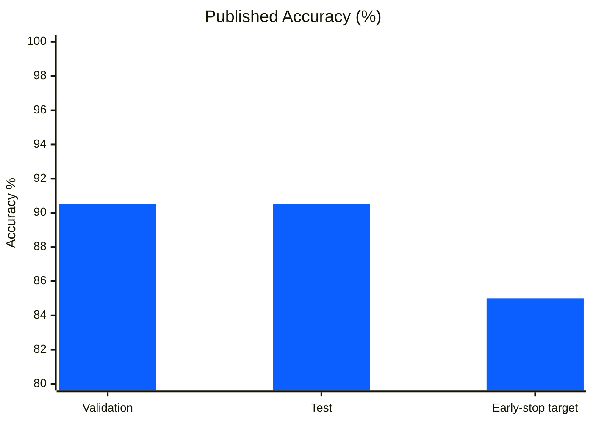
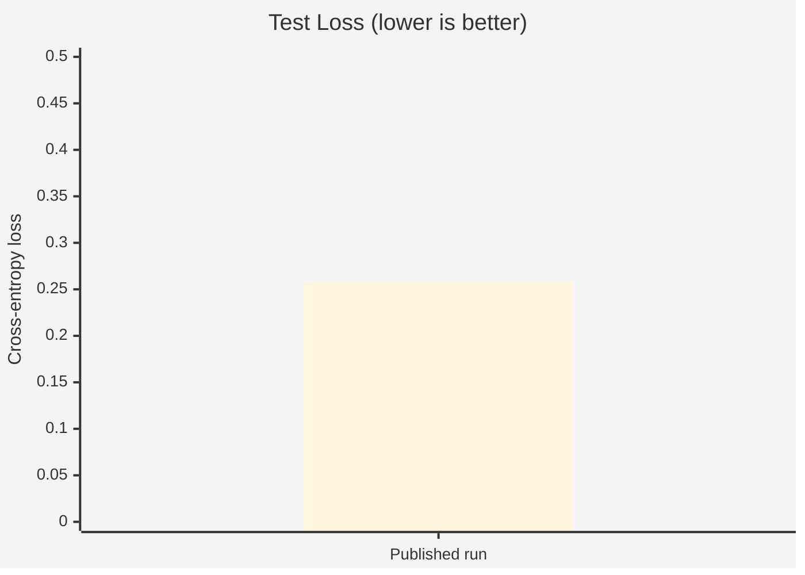
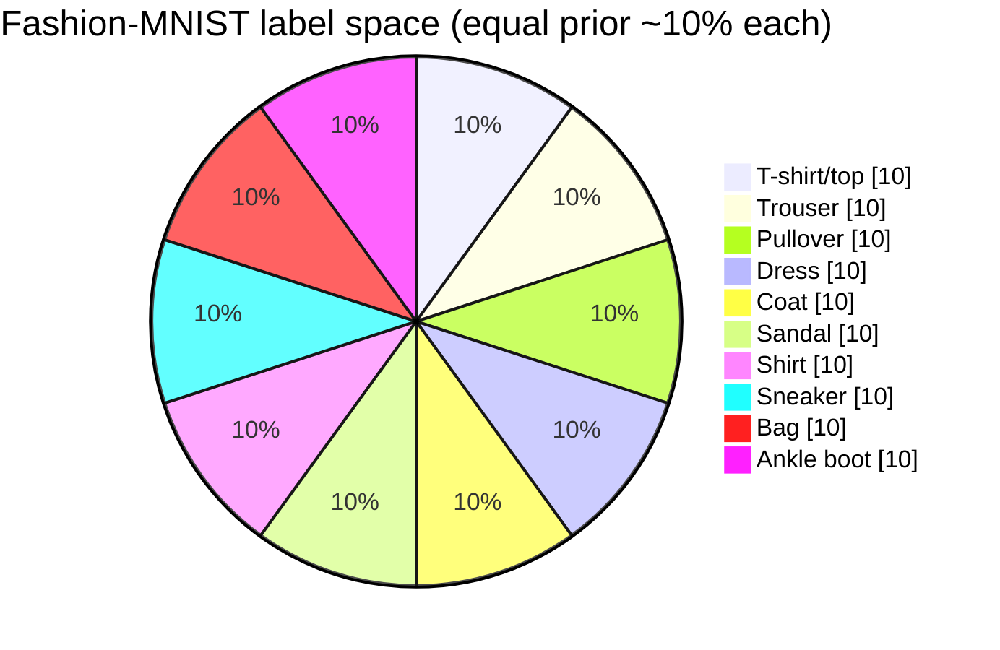
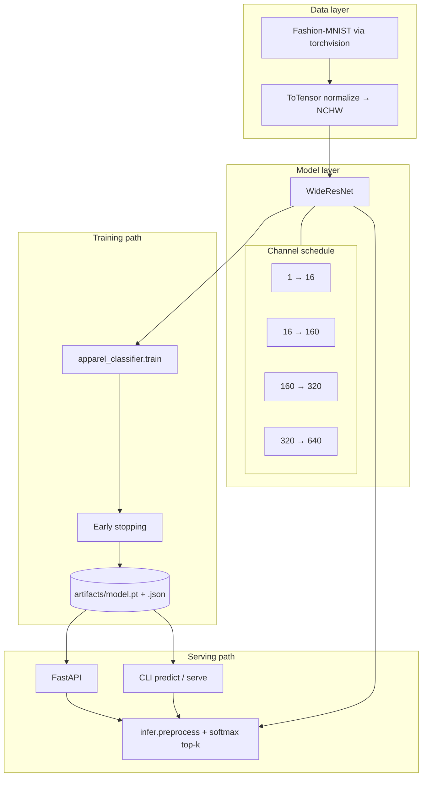
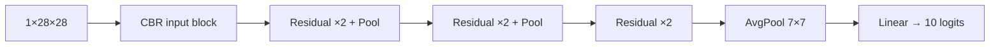
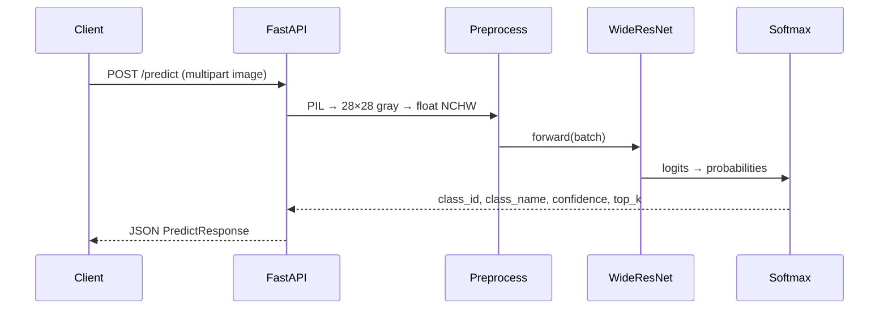

# Apparel Image Classification with WideResNet

### End-to-end computer vision system — train · evaluate · serve · containerize

[](https://github.com/ArchanaChetan07/Apparel-Image-Classification-with-WideResNet/actions/workflows/ci.yml)
[](tests/)
[](#benchmark-results)
[](https://www.python.org/)
[](https://pytorch.org/)
[](https://fastapi.tiangolo.com/)
[](docker-compose.yml)
[](LICENSE)

A **production-shaped deep learning package** that classifies apparel images into **10 clothing categories** using a **Wide Residual Network**, validated on **Fashion-MNIST**, and exposed as a **FastAPI inference microservice** with Docker, CLI, checkpoints, and a strict CI gate.

> **Headline result:** Validation **90.5%** · Test **90.5%** · Test loss **0.258**

```text
Image → Preprocess (28×28 gray) → WideResNet → Softmax → class + confidence + top-k
                                              ↘ artifacts/model.pt → FastAPI /predict
```

---

## Highlights

| Capability | Implementation |
|---|---|
| Deep CNN architecture | WideResNet with residual blocks, BatchNorm, Dropout, GAP |
| Dataset | Fashion-MNIST — 60k train / 10k test, 28×28 grayscale |
| Training loop | SGD, early stopping, checkpoint + metrics JSON |
| Inference API | FastAPI — `/health`, `/classes`, `/predict` (multipart) |
| Packaging | Installable `apparel_classifier` (`pyproject.toml`) |
| Delivery | Dockerfile + Compose + healthcheck |
| Quality bar | Ruff + 16 pytest cases + CI smoke train (must pass) |

---

## Benchmark Results

### Accuracy vs target

```text
Test accuracy     █████████████████████████████████████████████░░  90.5%
Val accuracy      █████████████████████████████████████████████░░  90.5%
Early-stop gate   ██████████████████████████████████████████░░░░░  85.0%
```





| Split | Accuracy | Loss |
|---|---:|---:|
| Validation | **90.5%** | — |
| Test | **90.5%** | **0.258** |

**Training recipe (published run):** batch size `32` · up to `40` epochs · SGD lr `0.01` · early stop patience `2` once val acc ≥ `0.85`.

---

## Class Catalog (10-way)



| ID | Class | ID | Class |
|---:|---|---:|---|
| 0 | T-shirt/top | 5 | Sandal |
| 1 | Trouser | 6 | Shirt |
| 2 | Pullover | 7 | Sneaker |
| 3 | Dress | 8 | Bag |
| 4 | Coat | 9 | Ankle boot |

---

## System Architecture



### Network forward path



### Request lifecycle



---

## Engineering Stack

| Layer | Technology |
|---|---|
| Language | Python 3.10+ |
| Deep learning | PyTorch, torchvision |
| Architecture | WideResNet (residual CNN) |
| Data | Fashion-MNIST (torchvision datasets) |
| API | FastAPI, Pydantic v2, Uvicorn, OpenAPI |
| Packaging | `pyproject.toml` editable install |
| Containers | Docker, Docker Compose |
| Quality | pytest, ruff, GitHub Actions |
| Ops signals | `/health`, MODEL_PATH, checkpoint metadata JSON |

### Skills demonstrated

- **Computer vision** — image classification, grayscale preprocessing, multi-class softmax
- **Deep learning** — residual learning, BatchNorm, Dropout, SGD optimization, early stopping
- **ML engineering** — train/eval split discipline, checkpointing, reproducible configs
- **API design** — typed request/response models, file upload inference, health endpoints
- **Platform hygiene** — Dockerized serving, CI that fails on real breakage, lint + coverage
- **Software packaging** — installable module, CLI entrypoints (`train` / `predict` / `serve`)

---

## Quick Start

```bash
git clone https://github.com/ArchanaChetan07/Apparel-Image-Classification-with-WideResNet.git
cd Apparel-Image-Classification-with-WideResNet

python -m venv .venv
# Windows: .venv\Scripts\activate
source .venv/bin/activate

pip install -r requirements-dev.txt
pip install -e .
```

### Train

```bash
# Full topology (portfolio / published recipe)
python -m apparel_classifier.train --epochs 40 --batch-size 32 --lr 0.01

# Narrow + subset (CI / local smoke)
python -m apparel_classifier.train --narrow --subset-size 512 --epochs 2
```

Artifacts written to `artifacts/model.pt` (+ `.json` metrics).

### Predict (CLI)

```bash
python -m apparel_classifier.cli predict path/to/image.png --model artifacts/model.pt
```

### Serve (HTTP)

```bash
export MODEL_PATH=artifacts/model.pt
uvicorn apparel_classifier.api:app --host 0.0.0.0 --port 8000
# Interactive docs → http://localhost:8000/docs
```

```bash
curl -F "file=@shirt.png" "http://localhost:8000/predict?top_k=3"
```

### Docker

```bash
python -m apparel_classifier.train --epochs 5   # create checkpoint first
docker compose up --build
```

---

## API Contract

| Method | Path | Purpose |
|---|---|---|
| `GET` | `/` | Service identity |
| `GET` | `/health` | Liveness + model load state + device |
| `GET` | `/classes` | Full label catalog |
| `POST` | `/predict` | Multipart image → class + confidence + top-k |
| `GET` | `/docs` | OpenAPI UI |

| Env var | Default | Meaning |
|---|---|---|
| `MODEL_PATH` | `artifacts/model.pt` | Checkpoint to load |
| `ALLOW_UNTRAINED` | `0` | Dev-only: boot with random narrow weights |

Example response:

```json
{
  "class_id": 0,
  "class_name": "T-shirt/top",
  "confidence": 0.91,
  "top_k": [
    {"class_id": 0, "class_name": "T-shirt/top", "confidence": 0.91},
    {"class_id": 6, "class_name": "Shirt", "confidence": 0.06},
    {"class_id": 2, "class_name": "Pullover", "confidence": 0.02}
  ]
}
```

---

## Repository Layout

```text
Apparel-Image-Classification-with-WideResNet/
├── apparel_classifier/          # Installable product package
│   ├── model.py                 # WideResNet (+ narrow CI variant)
│   ├── data.py                  # torchvision Fashion-MNIST loaders
│   ├── train.py                 # SGD loop, early stop, checkpoints
│   ├── infer.py                 # Preprocess + predict
│   ├── api.py                   # FastAPI microservice
│   ├── cli.py                   # train | predict | serve
│   └── labels.py                # 10-class catalog
├── tests/                       # Model · infer · API · smoke train
├── artifacts/                   # Checkpoints (generated)
├── Apparel_Image_Classification_with_WideResNet.ipynb
├── Dockerfile / docker-compose.yml
├── pyproject.toml / requirements*.txt
└── .github/workflows/ci.yml     # ruff + pytest + smoke train
```

---

## Training & Serving Pipeline


| Stage | Module | Notes |
|---|---|---|
| Data | `data.py` | No TensorFlow — torchvision only |
| Model | `model.py` | Default channels `[1,16,160,320,640]`; `--narrow` for CI |
| Train | `train.py` | Saves best val-acc weights |
| Infer | `infer.py` | Any RGB/gray image → 28×28 |
| Serve | `api.py` | Typed Pydantic responses |

---

## Quality Gates


```bash
ruff check apparel_classifier tests
pytest tests/ -v --cov=apparel_classifier
```

Local + GitHub Actions must pass; failures are not swallowed.

---

## From Notebook to Production

| Before | After |
|---|---|
| Notebook-only prototype | Installable Python package |
| TensorFlow + PyTorch mix | **PyTorch / torchvision only** |
| No HTTP surface | FastAPI + OpenAPI + health |
| Soft CI | Strict lint · test · smoke train |
| Placeholder tests | Real model / API / train coverage |
| Ad-hoc deps | `pyproject.toml` + pinned ranges |
| No ship path | Docker + Compose |

Exploratory notebook kept for research provenance:  
`Apparel_Image_Classification_with_WideResNet.ipynb`

---

## References

1. Zagoruyko & Komodakis — [Wide Residual Networks](https://arxiv.org/abs/1605.07146)
2. Xiao et al. — [Fashion-MNIST](https://github.com/zalandoresearch/fashion-mnist)
3. [PyTorch Documentation](https://pytorch.org/docs/)
4. [FastAPI Documentation](https://fastapi.tiangolo.com/)

---

## License

MIT — see [`LICENSE`](LICENSE).

---

<p align="center">
  <b>WideResNet · Fashion-MNIST · FastAPI · Docker · CI</b><br/>
  Train a real CNN, prove the accuracy, and ship the inference path.
</p>
