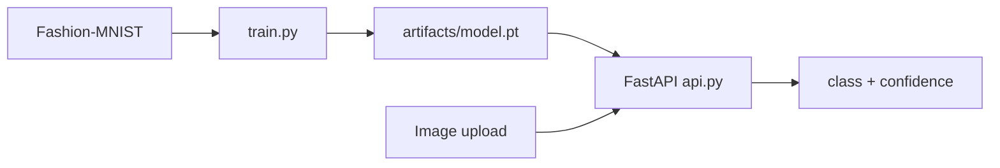
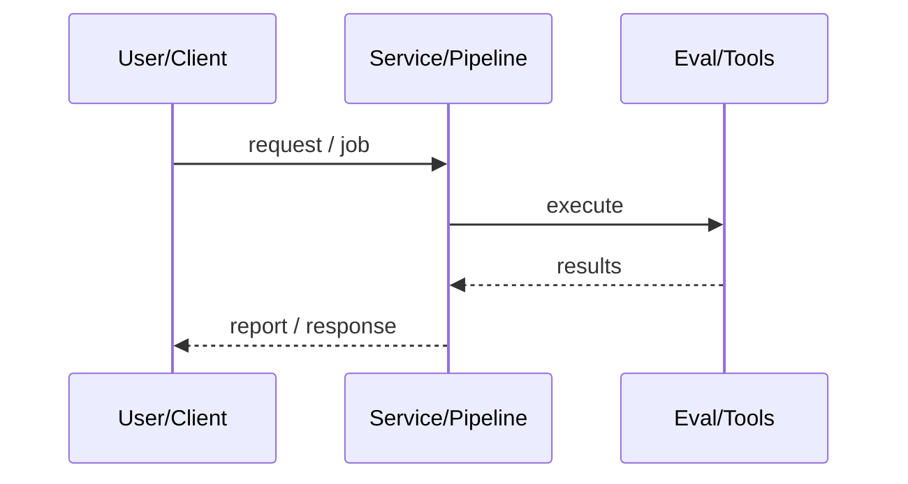
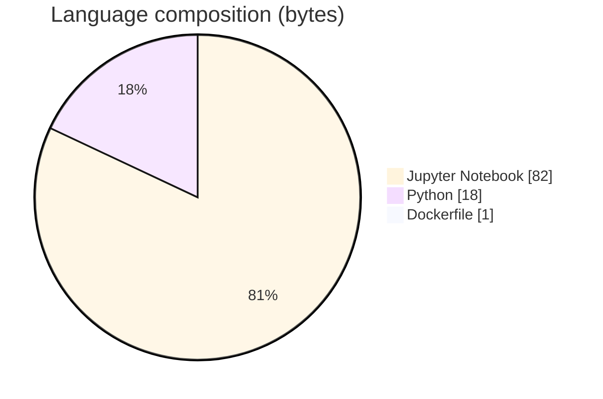

# Apparel Image Classification with WideResNet

### Fashion-MNIST WideResNet train/eval package with FastAPI inference, Docker Compose, MIT license, and CI-gated tests.

[](https://github.com/ArchanaChetan07/Apparel-Image-Classification-with-WideResNet)
[](https://github.com/ArchanaChetan07/Apparel-Image-Classification-with-WideResNet)
[](https://github.com/ArchanaChetan07/Apparel-Image-Classification-with-WideResNet)
[](https://github.com/ArchanaChetan07/Apparel-Image-Classification-with-WideResNet/actions)

---

## Overview

Need a production-shaped CV baseline: reproducible training, checkpoints, and an HTTP predict API—not only a Colab notebook.

PyTorch WideResNet (wide residual blocks, BN, dropout, GAP) on Fashion-MNIST; train loop with early stopping; FastAPI `/health` `/classes` `/predict`; installable `apparel_classifier` package; Compose + pytest.

Notebook run reports Test Accuracy 0.905 / Test Loss 0.258; package and API ready for local serving.

This repository is maintained as **production-minded portfolio work**: clear architecture, automated checks where present, and metrics that are **traceable to committed artifacts** (never invented).

---

## Architecture

Fashion-MNIST → preprocess 28×28 gray → WideResNet → softmax → checkpoint → FastAPI /predict





---

## Results & repository facts

> Only values found in code, configs, tests, or generated reports are listed. Absence of a clinical/ML accuracy number means it was **not** published in-repo.

| Metric | Value | Source |
|---|---|---|
| Test accuracy | **0.905 (90.5%)** | `Apparel_Image_Classification_with_WideResNet.ipynb` |
| Test loss | **0.258** | `Apparel_Image_Classification_with_WideResNet.ipynb` |
| Output classes | **10** | `apparel_classifier/labels.py` |
| License | **MIT** | `LICENSE` |
| Tracked files | **24** | `git tree` |
| Python modules | **13** | `git tree` |
| Test-related paths | **4** | `git tree` |
| CI workflows | **Yes** | `.github/workflows` |
| Docker present | **Yes** | `repo root` |



---

## Key features

- WideResNet classifier for 10 apparel classes
- Training CLI with checkpoint + metrics JSON
- FastAPI multipart /predict
- Docker Compose healthcheck
- CI with ruff + pytest

---

## Tech stack

| Layer | Technology |
|---|---|
| language | Python |
| dl | PyTorch WideResNet |
| data | Fashion-MNIST |
| api | FastAPI |
| packaging | pyproject.toml |
| deploy | Docker / Compose |

---

## Skills demonstrated

Jupyter Notebook · PyTorch · FastAPI · Docker Compose · pytest · Fashion-MNIST · CI/CD · testing · automation

Keyword surface: **Python · Jupyter Notebook · machine-learning · CI/CD · testing · API · Docker · automation · data-science · software-engineering · system-design · observability · LLM · cloud**

---

## Project structure

```text
Apparel-Image-Classification-with-WideResNet/
├── apparel_classifier/{model,train,infer,api,cli,data,labels}.py
├── Apparel_Image_Classification_with_WideResNet.ipynb
├── tests/
├── Dockerfile
├── docker-compose.yml
└── LICENSE
```

---

## Installation & usage

```bash
git clone https://github.com/ArchanaChetan07/Apparel-Image-Classification-with-WideResNet.git
cd Apparel-Image-Classification-with-WideResNet
pip install -r requirements.txt
pip install -e .
docker compose up --build
```

---

## How it works

Training fits WideResNet with SGD/early-stopping toward a target accuracy; the saved checkpoint is loaded by FastAPI for multipart image classification into the standard Fashion-MNIST apparel labels.

---

## Future improvements

- Commit metrics JSON artifacts from package train runs
- Add Grad-CAM explainability endpoint
- Publish container to a registry

---

## License

MIT.

---

<p align="center">
  <b>Apparel Image Classification with WideResNet</b><br/>
  <a href="https://github.com/ArchanaChetan07/Apparel-Image-Classification-with-WideResNet">github.com/ArchanaChetan07/Apparel-Image-Classification-with-WideResNet</a>
</p>
