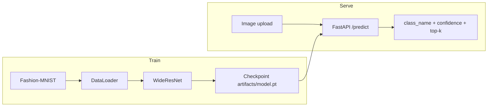
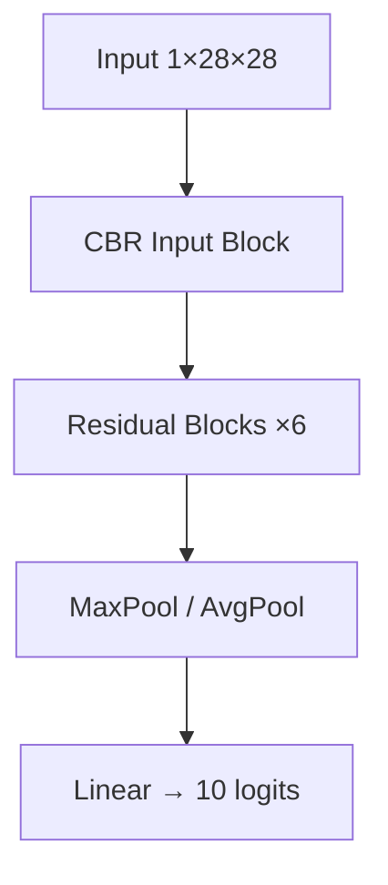

# Apparel Image Classification with WideResNet

### Production-ready Fashion-MNIST classifier — train, serve, ship

[](https://github.com/ArchanaChetan07/Apparel-Image-Classification-with-WideResNet/actions/workflows/ci.yml)
[](https://www.python.org/)
[](https://pytorch.org/)
[](https://fastapi.tiangolo.com/)
[](Dockerfile)
[](LICENSE)

Classify apparel images into **10 clothing categories** with a WideResNet CNN, then serve predictions through a **FastAPI** microservice — the same architecture that reached **90.5% test accuracy** on Fashion-MNIST.

| Metric | Value |
|---|---|
| Dataset | Fashion-MNIST (70k grayscale 28×28) |
| Classes | 10 apparel categories |
| Published accuracy | **Val 90.5% · Test 90.5% · Test loss 0.258** |
| Serving | FastAPI + Docker + health checks |
| Train stack | PyTorch only (TensorFlow removed) |

---

## Architecture





---

## Quick start

```bash
git clone https://github.com/ArchanaChetan07/Apparel-Image-Classification-with-WideResNet.git
cd Apparel-Image-Classification-with-WideResNet

python -m venv .venv
# Windows: .venv\Scripts\activate
source .venv/bin/activate

pip install -r requirements-dev.txt
pip install -e .
```

### Train

```bash
# Full portfolio model (matches notebook topology)
python -m apparel_classifier.train --epochs 40 --batch-size 32 --lr 0.01

# Fast smoke / CI path
python -m apparel_classifier.train --narrow --subset-size 512 --epochs 2
```

Checkpoint + metrics JSON land in `artifacts/`.

### Predict (CLI)

```bash
python -m apparel_classifier.cli predict path/to/image.png --model artifacts/model.pt
```

### Serve (API)

```bash
export MODEL_PATH=artifacts/model.pt
uvicorn apparel_classifier.api:app --host 0.0.0.0 --port 8000
# Docs: http://localhost:8000/docs
```

```bash
curl -F "file=@shirt.png" "http://localhost:8000/predict?top_k=3"
```

### Docker

```bash
# 1) train once so artifacts/model.pt exists
python -m apparel_classifier.train --epochs 5

# 2) ship
docker compose up --build
```

---

## API surface

| Method | Path | Purpose |
|---|---|---|
| `GET` | `/health` | Liveness + model load status |
| `GET` | `/classes` | Label catalog |
| `POST` | `/predict` | Multipart image → class + confidence + top-k |
| `GET` | `/docs` | OpenAPI UI |

Env vars:

| Variable | Default | Meaning |
|---|---|---|
| `MODEL_PATH` | `artifacts/model.pt` | Checkpoint path |
| `ALLOW_UNTRAINED` | `0` | If `1`, boot with random narrow weights (dev only) |

---

## Project layout

```text
apparel_classifier/     # Installable package
  model.py              # WideResNet (+ narrow CI variant)
  data.py               # torchvision Fashion-MNIST loaders
  train.py              # SGD train + early stop + checkpoint
  infer.py              # Preprocess + predict
  api.py                # FastAPI service
  cli.py                # train | predict | serve
tests/                  # Real model/API/train tests
artifacts/              # Checkpoints (generated)
notebook/               # Original research notebook (kept)
Dockerfile / compose    # Production container
```

---

## Results (published baseline)

| Split | Accuracy | Loss |
|---|---:|---:|
| Validation | **90.5%** | — |
| Test | **90.5%** | **0.258** |

Training recipe used for that result: batch 32 · 40 epochs max · SGD lr 0.01 · early stop patience 2 at ≥85% val acc.

Classes: T-shirt/top, Trouser, Pullover, Dress, Coat, Sandal, Shirt, Sneaker, Bag, Ankle boot.

---

## What changed for production

| Before | After |
|---|---|
| Notebook-only code | Installable Python package |
| TensorFlow + PyTorch mix | **PyTorch / torchvision only** |
| No service layer | FastAPI + health + OpenAPI |
| CI swallowed failures | Strict lint + pytest + smoke train |
| Placeholder unit tests | Tests that load the real model & API |
| Unpinned mega-deps | Scoped `requirements*.txt` + `pyproject.toml` |
| No container story | Dockerfile + Compose |

---

## Development

```bash
ruff check apparel_classifier tests
pytest tests/ -v --cov=apparel_classifier
```

Original exploratory notebook retained as  
`Apparel_Image_Classification_with_WideResNet.ipynb`.

---

## References

1. Zagoruyko & Komodakis — [Wide Residual Networks](https://arxiv.org/abs/1605.07146)
2. [Fashion-MNIST](https://github.com/zalandoresearch/fashion-mnist)
3. [PyTorch](https://pytorch.org/docs/)

## License

MIT
