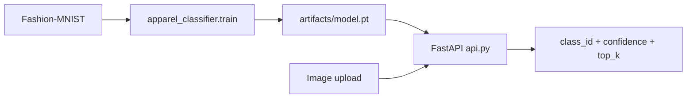
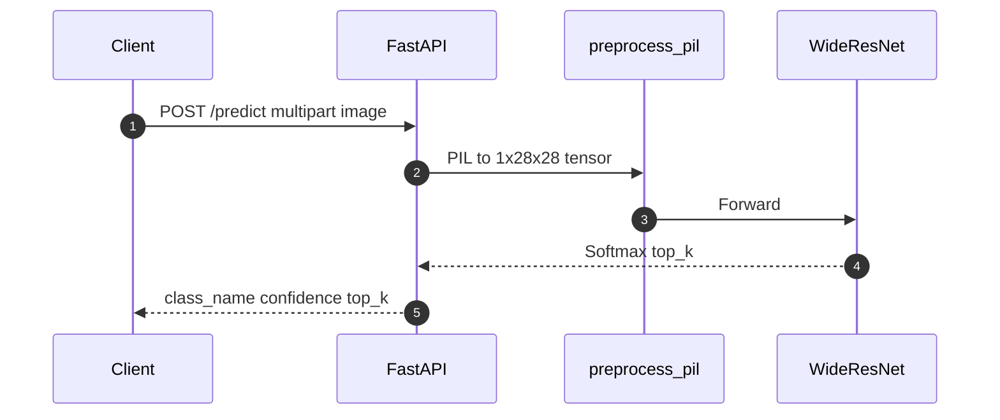
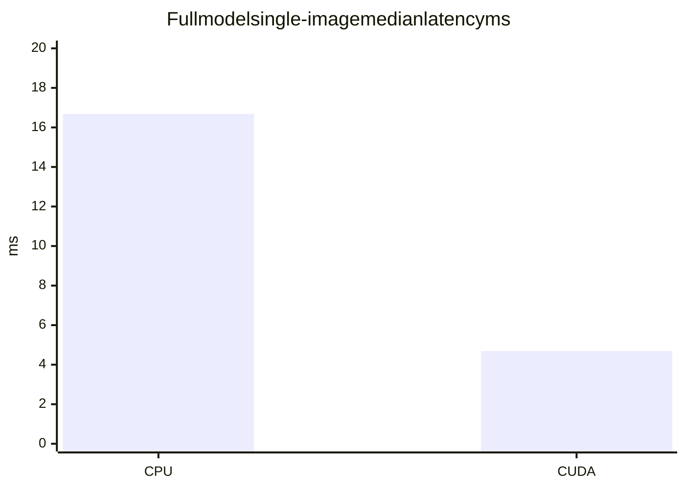

# Apparel Image Classification with WideResNet

Fashion-MNIST apparel classifier built with **PyTorch WideResNet**, served by **FastAPI**, and shipped with **Docker Compose**.

**90.5% test accuracy · 17.1M params · 16.7ms median inference (CPU, full model) · 4.7ms median (GPU) · 20/20 tests passing · CI green**

`docker compose up --build` → `POST /predict` with an image (API on `:8000`, or `API_PORT=8001` if 8000 is taken).

[](https://github.com/ArchanaChetan07/Apparel-Image-Classification-with-WideResNet/actions/workflows/ci.yml)
[](Dockerfile)
[](apparel_classifier/model.py)
[](apparel_classifier/api.py)
[](docker-compose.yml)
[](tests/)
[](LICENSE)

**Repo:** [github.com/ArchanaChetan07/Apparel-Image-Classification-with-WideResNet](https://github.com/ArchanaChetan07/Apparel-Image-Classification-with-WideResNet)  
**Evidence notebook:** [`Apparel_Image_Classification_with_WideResNet.ipynb`](Apparel_Image_Classification_with_WideResNet.ipynb)

---

## Overview

Production-shaped CV baseline: train a WideResNet on Fashion-MNIST, checkpoint it, and expose multipart image classification over HTTP — with pytest, Docker, and GitHub Actions CI.

| Item | Detail |
|---|---|
| Task | 10-class apparel image classification |
| Data | Fashion-MNIST · grayscale **28×28** · pixels `/255` |
| Model | WideResNet · channels `(1, 16, 160, 320, 640)` · **17,117,466** params |
| Train defaults | batch **32**, epochs **40**, SGD lr **0.01**, early-stop target **0.85**, patience **2** |
| Serve | FastAPI `GET /health` · `GET /classes` · `POST /predict` |
| Package | `apparel-classifier` **1.0.0** (`pyproject.toml`) |

Class labels: T-shirt/top, Trouser, Pullover, Dress, Coat, Sandal, Shirt, Sneaker, Bag, Ankle boot.

---

## Architecture





WideResNet blocks (code-faithful): CBR (Conv→BN→ReLU) · residual ConvBlocks with dropout **p=0.01** · MaxPool2d(2)×2 · AvgPool2d(7) · Linear→10. CI uses a **narrow** channel schedule `(1, 8, 16, 32, 64)` for smoke trains only (**173,778** params).

---

## Results

### Accuracy (notebook — published baseline)

| Metric | Value | Source |
|---|---|---|
| Test accuracy | **0.905 (90.5%)** | notebook cell output |
| Test loss | **0.258** | notebook cell output |

> Per-class precision/recall is **not** committed in-repo (no classification report artifact), so it is omitted rather than invented.

### Inference latency (measured this session)

Command: `python scripts/benchmark_latency.py` → `artifacts/latency_benchmark.json`  
Host: PyTorch `2.6.0+cu124` · GPU: **NVIDIA T1000 8GB** (when `cuda` available) · warmup **20** · repeats **50**

| Variant | Device | Single-image median | Single p95 | Batch-32 median | Per-image (batch-32 median) |
|---|---|---:|---:|---:|---:|
| Full (17.1M) | **CPU** | **16.681 ms** | 18.058 ms | 214.060 ms | 6.689 ms |
| Full (17.1M) | **CUDA** | **4.689 ms** | 7.926 ms | 39.330 ms | 1.229 ms |
| Narrow (CI) | CPU | 4.627 ms | 5.261 ms | 13.191 ms | 0.412 ms |
| Narrow (CI) | CUDA | 1.521 ms | 2.426 ms | 1.762 ms | 0.055 ms |



### Tests and CI (verified this session)

| Check | Result |
|---|---|
| `pytest tests/ -v` | **20/20 passed** |
| GitHub Actions `CI` on latest `main` | **success** (green) |
| Docker image build | **succeeded** (`docker compose build`) |
| Container `/predict` E2E | **200 OK** with `class_name` + `top_k` (ran on host port **8001** because **8000** was already bound by another container on this machine) |

---

## How to Run

```bash
git clone https://github.com/ArchanaChetan07/Apparel-Image-Classification-with-WideResNet.git
cd Apparel-Image-Classification-with-WideResNet

python -m venv .venv
# Windows: .\.venv\Scripts\Activate.ps1
source .venv/bin/activate

pip install torch torchvision --index-url https://download.pytorch.org/whl/cpu
pip install -r requirements.txt
pip install -e .

# Train full model (downloads Fashion-MNIST)
python -m apparel_classifier.train

# Or CI-style smoke checkpoint
python -m apparel_classifier.train --narrow --subset-size 512 --epochs 1
# copy/rename to artifacts/model.pt for the default Compose MODEL_PATH

uvicorn apparel_classifier.api:app --host 0.0.0.0 --port 8000
```

Docker Compose:

```bash
# Needs artifacts/model.pt (train first). If port 8000 is busy:
API_PORT=8001 docker compose up --build

curl -X POST "http://127.0.0.1:8001/predict?top_k=3" -F "file=@your.png"
```

Latency bench:

```bash
python scripts/benchmark_latency.py --out artifacts/latency_benchmark.json
```

Env: `MODEL_PATH` (default `artifacts/model.pt`) · `ALLOW_UNTRAINED=1` for wiring-only boots without a checkpoint.

---

## Tests

```bash
pytest tests/ -v
```

| Module | Focus |
|---|---|
| `test_api.py` | `/`, `/health`, `/classes`, `/predict` |
| `test_infer.py` | preprocess + predict helpers |
| `test_model.py` | shapes / channels / build |
| `test_train.py` | early-stop / config helpers |
| `test_latency.py` | CPU (and GPU if present) median ceilings |

CI (`.github/workflows/ci.yml`): ruff · pytest · narrow smoke train · Docker build on `main` / PRs.

---

## Tech Stack

| Layer | Technology |
|---|---|
| Language | Python 3.11 |
| DL | PyTorch WideResNet |
| Data | Fashion-MNIST (torchvision) |
| API | FastAPI + uvicorn + python-multipart |
| Packaging | pyproject.toml / setuptools |
| Containers | Dockerfile + Docker Compose |
| Quality | pytest · ruff · GitHub Actions |

---

## License

MIT — see [LICENSE](LICENSE).

## Author

**Archana Chetan** · [@ArchanaChetan07](https://github.com/ArchanaChetan07)
