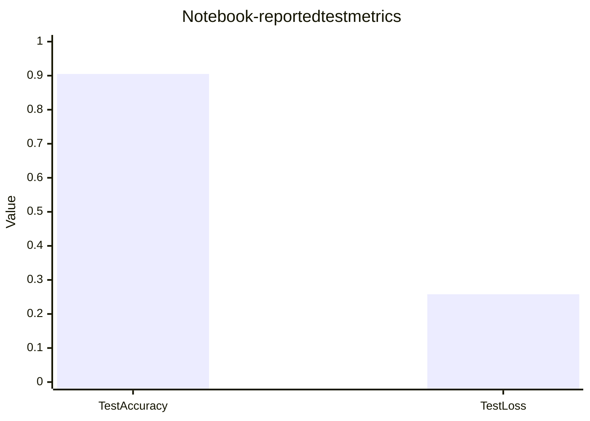
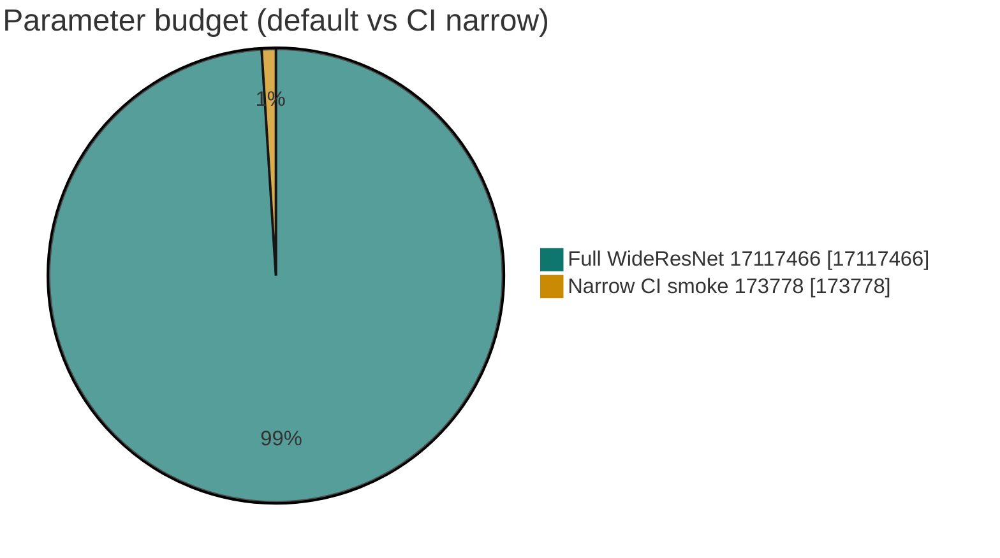
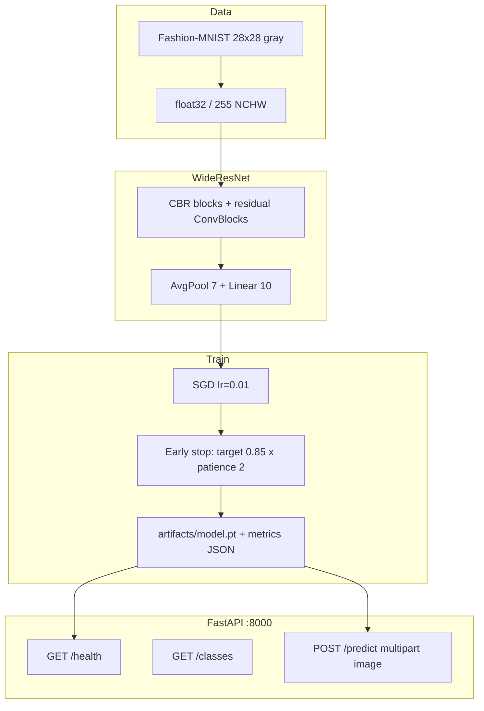
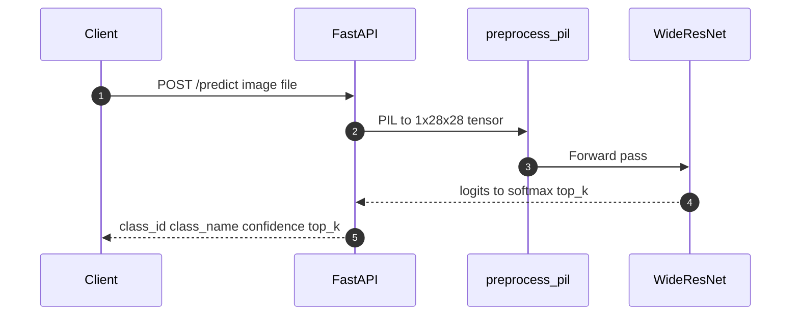

# Apparel Image Classification with WideResNet

### Fashion-MNIST WideResNet train/eval package with FastAPI inference, Docker Compose, MIT license, and CI-gated tests

[](https://github.com/ArchanaChetan07/Apparel-Image-Classification-with-WideResNet/actions/workflows/ci.yml)
[](Dockerfile)
[](apparel_classifier/model.py)
[](apparel_classifier/api.py)
[](docker-compose.yml)
[](tests/)
[](LICENSE)

> Production-shaped CV baseline: reproducible **WideResNet** training on **Fashion-MNIST**, checkpointing, and an HTTP **`/predict`** API — not only a Colab notebook.

**Evidence notebook:** [`Apparel_Image_Classification_with_WideResNet.ipynb`](Apparel_Image_Classification_with_WideResNet.ipynb)  
**Repo:** [github.com/ArchanaChetan07/Apparel-Image-Classification-with-WideResNet](https://github.com/ArchanaChetan07/Apparel-Image-Classification-with-WideResNet)

---

## Verified results

| Signal | Value | Source |
|---|---|---|
| Test accuracy | **0.905 (90.5%)** | notebook cell output / Results |
| Test loss | **0.258** | same |
| Classes | **10** Fashion-MNIST apparel labels | `apparel_classifier/labels.py` |
| Default train hyperparams | batch **32**, epochs **40**, SGD lr **0.01**, target acc **0.85**, patience **2** | notebook + `TrainConfig` |
| Input | grayscale **28 x 28**, pixels `/255` | notebook / `data.py` |
| Channel schedule (full) | **`(1, 16, 160, 320, 640)`** | `WideResNet.DEFAULT_CHANNELS` |
| Full model parameters | **17,117,466** | `sum(p.numel())` on default model |
| Narrow (CI) channels | **`(1, 8, 16, 32, 64)`** · **173,778** params | `NARROW_CHANNELS` |
| Dropout in residual blocks | **p = 0.01** | `ConvBlock` |
| Package version | **1.0.0** | `pyproject.toml` / `__version__` |
| Unit tests | **16** | `tests/` |
| Tracked files | **24** | git tree |
| License | **MIT** | `LICENSE` |





---

## Class catalog

| ID | Label |
|---:|---|
| 0 | T-shirt/top |
| 1 | Trouser |
| 2 | Pullover |
| 3 | Dress |
| 4 | Coat |
| 5 | Sandal |
| 6 | Shirt |
| 7 | Sneaker |
| 8 | Bag |
| 9 | Ankle boot |

---

## Architecture



### Inference sequence



### Model blocks (code-faithful)

- **CBRBlock:** Conv3x3 -> BatchNorm -> ReLU  
- **ConvBlock:** residual path with optional 1x1 projection, dropout **0.01**  
- **WideResNet:** six residual stages, MaxPool2d(2) x2, AvgPool2d(7), Flatten, Linear -> **10**

---

## API

| Method | Path | Role |
|---|---|---|
| GET | `/` | Service metadata + docs links |
| GET | `/health` | Status, version, model_loaded, device |
| GET | `/classes` | 10 Fashion-MNIST labels |
| POST | `/predict` | Multipart image -> `class_id`, `class_name`, `confidence`, `top_k` |

Env:

| Variable | Default | Meaning |
|---|---|---|
| `MODEL_PATH` | `artifacts/model.pt` | Checkpoint location |
| `ALLOW_UNTRAINED` | `0` | If `1`, boot narrow random weights for wiring tests |

---

## Quick start

```bash
git clone https://github.com/ArchanaChetan07/Apparel-Image-Classification-with-WideResNet.git
cd Apparel-Image-Classification-with-WideResNet

python -m venv .venv
# Windows: .\.venv\Scripts\Activate.ps1
source .venv/bin/activate

pip install torch torchvision --index-url https://download.pytorch.org/whl/cpu
pip install -r requirements.txt
pip install -e .

# Full train (Fashion-MNIST download)
python -m apparel_classifier.train

# Serve
uvicorn apparel_classifier.api:app --host 0.0.0.0 --port 8000
```

Docker Compose (expects a checkpoint under `artifacts/`):

```bash
docker compose up --build
# http://localhost:8000/docs
```

CI-style smoke train:

```bash
python -m apparel_classifier.train --narrow --subset-size 128 --epochs 1 --batch-size 32
pytest tests/ -v
```

CLI entry point (from `pyproject.toml`): `apparel-classify`.

---

## Repository layout

```text
Apparel-Image-Classification-with-WideResNet/   # 24 tracked files
├── apparel_classifier/
│   ├── model.py          # WideResNet + narrow variant
│   ├── train.py          # SGD, early stop, checkpoint
│   ├── data.py           # Fashion-MNIST loaders
│   ├── infer.py          # preprocess + predict
│   ├── api.py            # FastAPI service
│   ├── labels.py         # 10 class names
│   └── cli.py
├── Apparel_Image_Classification_with_WideResNet.ipynb
├── tests/                # 16 pytest cases
├── artifacts/            # checkpoints (gitkeep; train to populate)
├── Dockerfile
├── docker-compose.yml
├── pyproject.toml        # apparel-classifier 1.0.0
└── LICENSE               # MIT
```

---

## Skills surface

`Python` · `PyTorch` · `WideResNet` · `Fashion-MNIST` · `computer vision` · `image classification` · `BatchNorm` · `dropout` · `SGD` · `early stopping` · `checkpointing` · `FastAPI` · `uvicorn` · `Docker` · `Docker Compose` · `pytest` · `ruff` · `GitHub Actions` · `MIT`

---

## Design notes

1. **Notebook metrics are the published baseline** — 90.5% / 0.258 from the executed notebook; retrain variance is expected.  
2. **Package matches the architecture** — channel schedule and train defaults mirror the notebook; `narrow=True` exists for CI smoke only.  
3. **Serving is gated on a real checkpoint** unless `ALLOW_UNTRAINED=1`.  
4. **Honest packaging** — topics/README claim CV + FastAPI + Docker, not unrelated stacks.

---

## Roadmap

- Commit a small metrics JSON from a pinned seed full train  
- Grad-CAM or saliency endpoint for explainability  
- Registry publish for the Compose image  

---

## Author

**Archana Chetan** · [@ArchanaChetan07](https://github.com/ArchanaChetan07)

Portfolio CV system: train a WideResNet on Fashion-MNIST, package it, and ship inference behind FastAPI + Docker.

---

## License

MIT — see [LICENSE](LICENSE).
